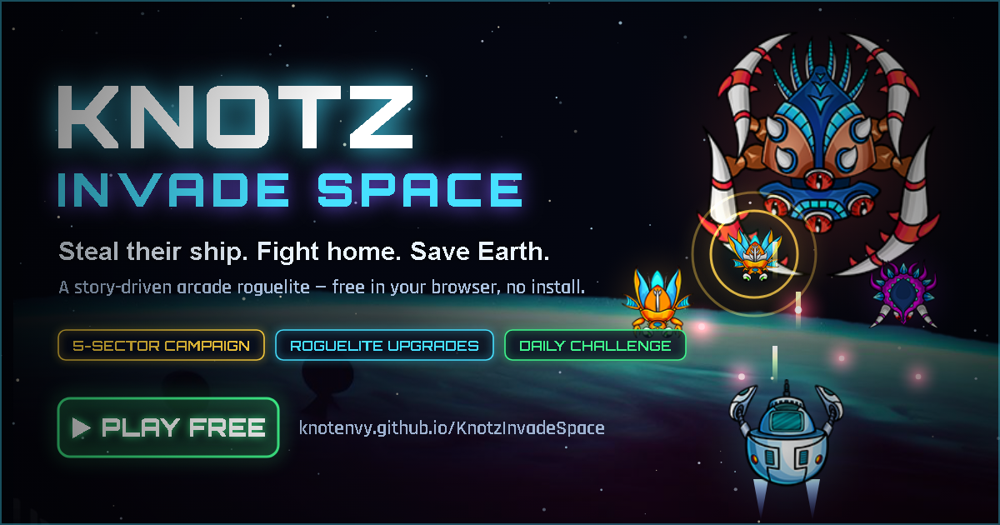

# 🚀 Knotz: Invade Space

A modern, juiced-up reimagining of the classic *Space Invaders* — built with the
HTML5 Canvas and vanilla JavaScript, **no build step and no dependencies**.
Blast through escalating waves of alien **Beetlemorphs**, armored **Rhinomorphs**,
fast **Stingers** and bursting **Splitters**, dodge Galaga-style dive-bombers and
drifting **asteroids**, grab power-ups, and topple a multi-phase **Overlord** boss
at the end of every sector. Bank your earnings into permanent upgrades in the
**Hangar** — it's a roguelite, so every run makes you stronger.

  

### ▶️ [**Play it now in your browser →**](https://knotenvy.github.io/KnotzInvadeSpace/)

No install, no sign-up. Runs on desktop and mobile.

## ✨ Features

- **Story campaign — OPERATION HOMECOMING** — fight home through **5 hand-scripted
  sectors** to break the siege of Earth, flying a stolen Hive ship with an awakened
  AI while the carrier **UES Orion** follows the corridor you clear. Sector
  briefings with story dialogue and a live sector map, in-mission comm chatter
  (your ship, Earth Command... and the HIVEMIND itself), warp jumps, and **mid-run
  docking**: credits bank after every sector, and you spend them on the Orion's
  deck — repairs, refit, upgrades that apply immediately — before the next
  briefing. Ends in a final 4-phase **Mothership** duel over Earth.
- **Three game modes** — the story **Campaign**, an unbounded **Endless** mode,
  and a date-seeded **Daily Challenge** with rotating modifiers.
- **Roguelite meta-progression** — earn **credits** every run and spend them in the
  **Hangar** on 7 permanent upgrades (hull, engines, beam, twin auto-cannons, magnet
  field, combat drone, start-shield). Progress is saved locally between sessions.
- **Juicy game feel** — screen shake, particle explosions, hit-flashes, bullet
  trails, muzzle flashes, floating score popups and a combo multiplier system.
- **Varied enemies & elites** — Beetlemorphs, armored Rhinomorphs, fast aggressive
  **Stingers**, and **Splitters** that burst into diving minions — any of which can
  spawn as a glowing **elite** with more health and guaranteed loot.
- **Smart enemies** — formations that march and descend, plus enemies that break
  off to dive-bomb you and re-join from the top.
- **Combat Drone wingman** & **Magnet Field** upgrades that auto-fire and vacuum up
  power-ups, plus **twin cannons** for double the firepower.
- **Environmental hazards** — rotating **asteroids** drift in, shatter into smaller
  chunks when shot, and wreck your ship on contact.
- **Energy beam** — hold a key to unleash a continuous damage beam that drains
  (and regenerates) your ship's energy.
- **Power-ups** — Rapid Fire, Spread Shot, Shield, Energy refill, Smart Bomb and
  Extra Life drop from destroyed enemies.
- **Boss battles** — a rotating cast of data-driven bosses (**Overlord**,
  **Weaver**, **Warden**, **Void Herald**) with distinct movement and attack
  patterns, plus quick **mini-boss** escorts on ordinary waves. Each tier is tougher.
- **Endless progression** — difficulty, formation size and armor scale up; each
  cleared sector swaps in a new space backdrop.
- **Parallax starfields** drifting over your space background art.
- **Procedural audio** — every sound effect and the background music are
  synthesized at runtime with the Web Audio API (no audio files needed).
- **Scalable visuals** — offscreen threshold **bloom**, hit-stop, zoom-punch and
  textured explosions, with **Low / Medium / High** graphics tiers (and
  reduced-motion + screen-shake toggles) so it stays smooth on weak hardware.
- **Plays everywhere** — keyboard *and* mouse/touch controls; the canvas scales
  to fit any screen. High score is saved locally.

## 🎮 Controls

| Action       | Keys                          | Touch / Mouse        |
|--------------|-------------------------------|----------------------|
| Move         | `←` `→` or `A` `D`            | Drag                 |
| Fire         | `Space`                       | Tap & hold           |
| Energy Beam  | `Shift` or `X`                | —                    |
| Pause        | `Esc` or `P`                  | —                    |
| Mute sound   | `M`                           | —                    |
| Start / Retry| `Enter`                       | Tap                  |
| Hangar       | `H` (menu / game over)        | Tap rows to buy      |
| Quit to menu | `Q` (when paused / game over) | —                    |

**Tip:** chain kills quickly to build a combo multiplier (up to ×8) for huge scores,
and grab the guaranteed power-up shower after each boss.

## 🛰️ The Hangar (roguelite loop)

Every run pays out **credits** based on your score, waves cleared and bosses slain.
Press **H** from the title or game-over screen to enter the **Hangar** and invest them.
In the **Campaign**, the Hangar is also the **Orion's flight deck**: you dock between
sectors, bank that sector's payout on the spot, and refit mid-run:

| Upgrade | Effect |
|---------|--------|
| **Hull Plating** | +1 starting & max life per level |
| **Ion Engines** | +8% move speed per level |
| **Beam Core** | +25% beam energy & regen per level |
| **Auto-Cannons** | Faster fire; **twin shot** at Lv2 |
| **Magnet Field** | Pulls power-ups toward your ship |
| **Combat Drone** | Adds an auto-firing wingman (up to 2) |
| **Aegis Start** | Begin every run with a shield |

Upgrades are permanent and saved locally, so each run leaves you a little stronger —
push deeper, earn more, unlock more.

## ▶️ Getting Started

**Easiest:** just [play the hosted version](https://knotenvy.github.io/KnotzInvadeSpace/).

To run it locally — no install, no server, no build:

1. Clone or download this repository.
2. Open **`index.html`** in any modern browser (Chrome, Edge, Firefox, Safari).

That's it. *(Music/SFX start on your first key press or tap, per browser autoplay rules.)*

## 🗂️ Project Structure

The game is organized into small, single-responsibility modules loaded as plain
scripts (so it runs straight from the file system — no bundler required):

| File | Responsibility |
|------|----------------|
| `index.html` / `styles.css` | Page shell + canvas; everything else renders to canvas |
| `src/config.js`   | All tunables, palette and the asset manifest |
| `src/utils.js`    | Math, collision (AABB), text/draw helpers + zero-alloc `Trail` ring buffer |
| `src/glowatlas.js`| Pre-rendered glow sprite cache (perf: replaces per-frame `shadowBlur`) |
| `src/audio.js`    | Web Audio synthesized SFX + procedural music |
| `src/input.js`    | Unified keyboard + pointer/touch input |
| `src/particles.js`| Pooled particles, explosions, score popups |
| `src/postfx.js`   | Offscreen threshold-bloom post-processing |
| `src/starfield.js`| Parallax background + scrolling star layers |
| `src/projectile.js`| Pooled bullets (trails) and the player energy beam |
| `src/powerup.js`  | Falling collectibles and their effects |
| `src/meta.js`     | Roguelite profile (credits/upgrades/hi-score) + upgrade catalog |
| `src/player.js`   | Player ship: movement, banking, weapons, shield, lives, upgrades |
| `src/enemy.js`    | Enemy base + Beetlemorph / Rhinomorph / Stinger / Splitter + elites |
| `src/boss.js`     | Data-driven multi-phase bosses + mini-bosses + the final Mothership |
| `src/campaign.js` | OPERATION HOMECOMING: scripted sectors, story dialogue, threat intel |
| `src/wave.js`     | Formation movement, edge bouncing, diver/fire scheduling, composition |
| `src/drone.js`    | Combat Drone wingman that auto-fires |
| `src/hazard.js`   | Drifting, splitting asteroids |
| `src/ui.js`       | HUD, menu, pause, game-over and banner screens |
| `src/hangar.js`   | Upgrade shop: between runs, and docked mid-campaign on the UES Orion |
| `src/game.js`     | Orchestrator: state machine, collisions, scoring, progression |
| `src/main.js`     | Asset preloader, responsive canvas, fixed-timestep loop |

### Assets
`player.png`, `player_jets.png`, `beetlemorph.png`, `rhinomorph.png`, `boss.png`
are sprite sheets; `assets/background*.png` are the per-sector backdrops.

## 🛠️ Tweaking the Game

Almost everything balance- or look-related lives in **`src/config.js`** — ship
speed, fire rates, enemy health, drop chances, boss health scaling, the color
palette and which backgrounds map to which sectors. Tune away.

## 📜 License

MIT License — see [LICENSE.md](LICENSE.md).
